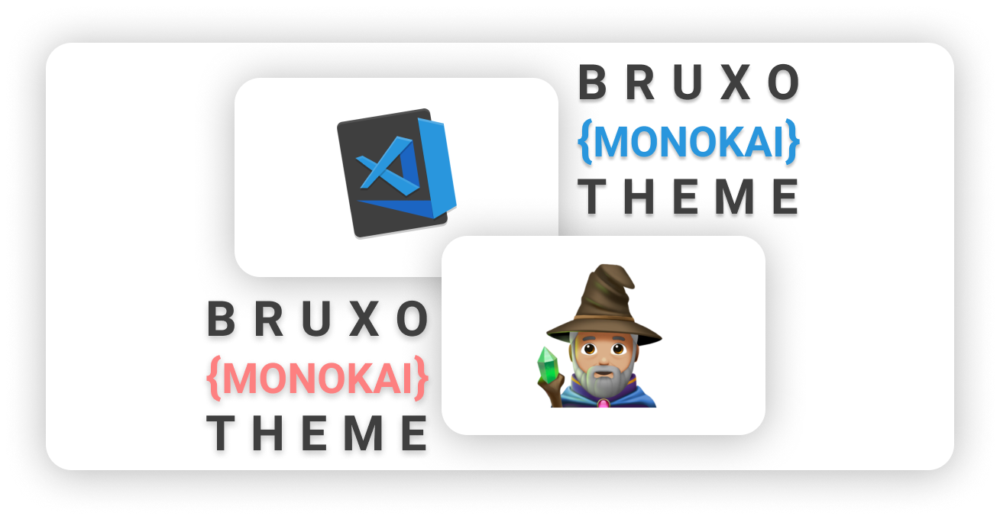

# Vos apresento o seu novo tema de 2021!🪄

    </img>

## O que é o bruxo monokai?

É um tema que venho modificando no meu Vscode pessoal desde 2019 e baseando na sintaxe do Monokai e do Monokai Pro e escolhi por criar o meu próprio tema

    </img>

### Como instalar?

* Para instalar localmente basta copiar ou clonar esse repositório para a pasta `<user home>/.vscode/extensions`, `<user home>/.vscode-oss/extensions` ou se caso esteja no windows: `%USERPROFILE%\.vscode\extensions` e reinicie o Code

* Após isso pode buscar buscar o tema `Bruxo Monokai` com Visual Studio Code com `Ctrl+Shift+P` e digite `>tema` ou `>theme` se estiver em inglês.

> Futuramente penso em publicar porém ainda não o farei!

## Paleta de cores:

    </img>

